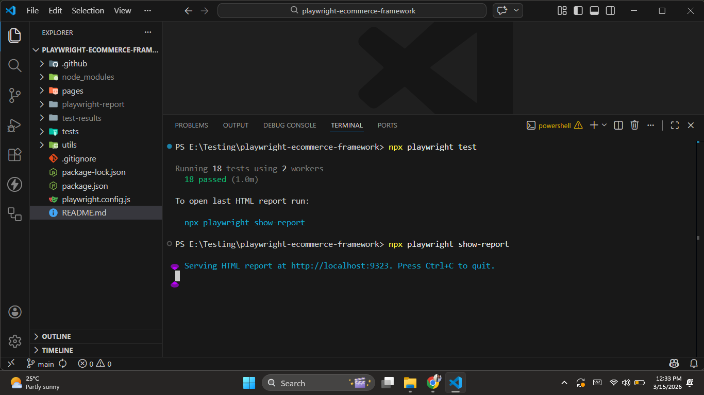
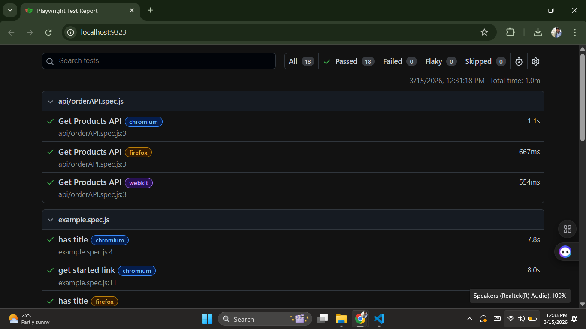
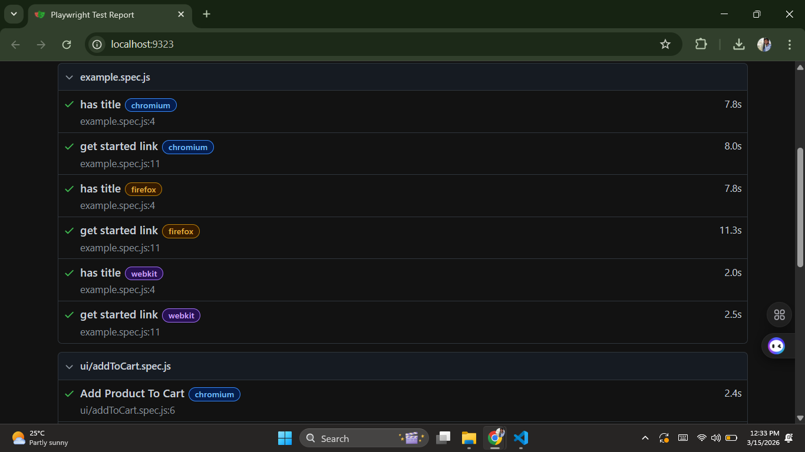
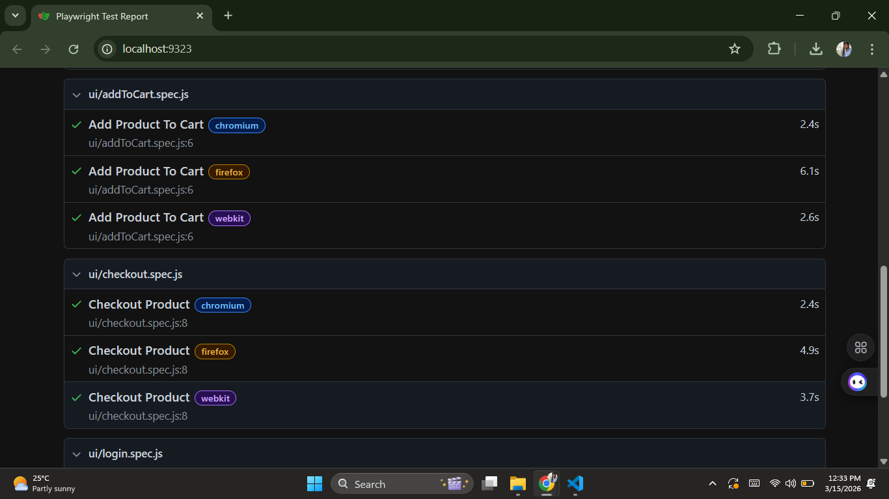
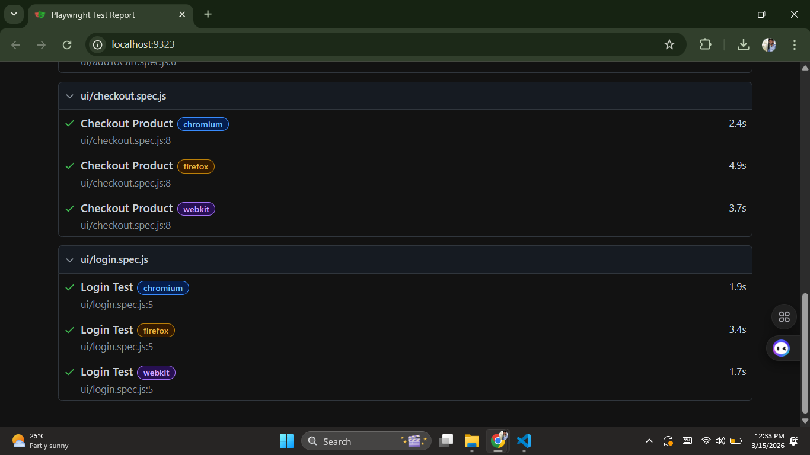

# Playwright UI + API Automation Framework

## Project Overview

This project demonstrates an end-to-end automation testing framework for an E-Commerce application using Playwright.

The framework automates real user workflows including login, product selection, cart operations, checkout, and API validation.

## Features

• UI automation using Playwright  
• API testing using Playwright request context  
• Page Object Model (POM) design pattern  
• Test data management  
• HTML test reports  
• CI/CD integration with GitHub Actions  

## Tech Stack

• Playwright  
• JavaScript  
• Node.js  
• GitHub Actions  

## Project Structure

playwright-ecommerce-framework

tests/  
ui/  
api/  

pages/  

utils/  

playwright.config.js  

## Test Scenarios Covered

1. User Login Automation  
2. Product Search and Selection  
3. Add Product to Cart  
4. Checkout Workflow  
5. API Product Validation  

## Installation

Clone the repository

git clone https://github.com/Prajwalpjoshi/playwright-ui-api-automation-framework.git

Install dependencies

npm install

Install Playwright browsers

npx playwright install

Run tests

npx playwright test

Open HTML report

npx playwright show-report

## Author

Prajwal Joshi

## Test Execution

### Terminal Test Run

### Playwright HTML Report

  
  

  
  

